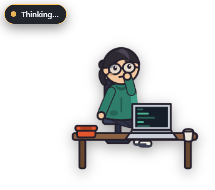
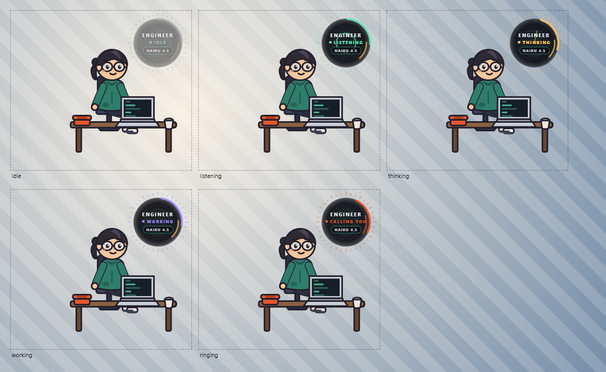

# Engineer

A small engineer lives in the corner of your desktop. You tell him what you want,
he asks the few questions he needs, then he opens his laptop and actually builds
it. When he needs a decision from you, his telephone rings.

He is a face on a real headless coding agent (Claude Code via the Claude Agent
SDK) — not a chat mock-up. Every progress message corresponds to a tool call that
really ran.



His state, at a glance — idle, listening, thinking, working, and the telephone
wanting you:



---

## Getting it

You build it once, then never need the toolchain again. **Node 18+:**

```bash
git clone https://github.com/AnSa30-06/engineer-agent.git
```

**Windows 10/11** — produces `dist\Engineer.exe`, ~165 MB, self-contained:

```bash
cd engineer-agent && npm install && npm run vendor && npm run dist
```

**macOS** — produces `dist/Engineer-arm64.dmg` (and `-x64` for Intel):

```bash
cd engineer-agent && npm install && npm run vendor && npm run dist:mac
```

`npm run vendor` bundles the speech-recognition runtime (~90 MB, not committed —
it is generated). To run from source without packaging: `npm start`.

### A note for macOS

**Building it yourself needs no Apple Developer account and shows no warnings.**
Gatekeeper only objects to files carrying the `com.apple.quarantine` flag, which
is set by your *browser* on download — a build you produced locally never has it.

A `.dmg` **downloaded** from the [releases page](https://github.com/AnSa30-06/engineer-agent/releases)
is a different matter: it is signed ad-hoc and not notarized, so macOS will
refuse it once. Open **System Settings → Privacy & Security**, find the blocked
app and click **Open Anyway** (on macOS 14 and earlier, right-click the app →
Open). Or strip the flag directly:

```bash
xattr -d com.apple.quarantine /Applications/Engineer.app
```

⚠️ **The mac build has never been run by anyone.** It is produced by CI on a
macOS runner and the artifact is real, but no one has yet watched the overlay
behave on a Mac — see [Known limits](#known-limits).

---

## Using it

```
dist\Engineer.exe
```

Double-click it. No terminal, no dev server, no Node install, no Python — the
built `.exe` carries everything.

He walks in, sits down, opens his laptop and says hello. **Then just talk to
him** — say what you want built, in plain English, the way you would describe it
to a person. He asks a few questions back, and when he has enough he says so and
starts building.

**Everything he writes goes in one folder**, and he cannot touch anything
outside it. It defaults to `%USERPROFILE%\EngineerProjects`; to put it somewhere
else, click him → Settings → Project folder, ideally before you ask for
anything.

A first session sounds like this:

> **You:** I want a small command line tool.
> **Him:** What's the main thing it needs to do?
> **You:** Call it wordcount. Give it a text file and it prints how many words are in it. Plain Node, one file.
> **Him:** How do they run it — filename as an argument, or pipe text in?
> **You:** As an argument. That's everything, go ahead and build it.
> **Him:** Got it, I'll build it now.

Then he works, narrates what he is doing in plain English, and tells you what he
ended up with. The file appears in your project folder.

**Say his name to get his attention** — "Engineer, build me…". The microphone is
open in a room, so until he is addressed he ignores what he hears. Once you are
in a conversation you do not need his name again, and **you can talk over him to
cut him off** mid-sentence. You can change or disable the wake word in Settings.

**He remembers between sessions.** What he built for you, and what you have
already told him, survive closing the app — so he opens knowing where he left
off instead of asking you the same questions again.

- **The dial above him is his state**, at a glance and from across the room:
  grey idle · teal listening (the ring grows with your voice) · amber thinking ·
  blue speaking · violet working · **coral and jolting when the telephone needs
  you**. Each state moves differently as well as being a different colour, so it
  still reads if you are colour-blind. The chip underneath is the model he is
  using — it changes when the coding agent takes over.
- **Click the engineer** to open his controls and progress log.
- **Tray icon** (bottom-right of the taskbar) for controls, the project folder, and Quit.
- Closing the app makes him disappear completely — he only exists while it runs.

---

## What you need

| Thing | Needed for | Notes |
|---|---|---|
| **A Claude credential** | the interview and the building | Either an existing **Claude Code login** on the machine, or an **Anthropic API key** pasted into Settings. Nothing else to install. |
| **Internet** | speech, and the first run only | The voice (Microsoft Edge neural TTS) is generated online. The speech-recognition model (Moonshine) downloads once — a few hundred MB — and then works offline. |
| **A microphone** | talking to him | Optional — you can type to him in the controls instead. |

Nothing else is required. The Agent SDK ships its own CLI inside the `.exe`, so
the machine does **not** need Node, Python or Claude Code installed.

---

## Setting it up

Open the controls (click the engineer) → **Settings**.

**Project folder** — the only directory he is allowed to touch. Pick it before
you ask for anything. Attempts to write outside it are refused and logged, in
every permission mode.

**Credentials** — leave the API key blank to use the Claude Code login already on
the machine. Otherwise paste an Anthropic API key; it is stored in
`%APPDATA%\engineer-agent\config.json`. `ANTHROPIC_API_KEY` in the environment
always wins, so you never have to write a key to disk. No key is ever committed
or bundled.

**Permission mode**

| Mode | Behaviour |
|---|---|
| **Ask** | He checks with you before changing any file or running any command. |
| **Standard** *(default)* | Normal development happens freely; anything consequential (`rm -rf`, `git push`, `npm publish`, `sudo`, piping a download into a shell…) rings the phone first. |
| **Autonomous** | He works with minimal interruption. Consequential operations still ring, and he still cannot leave the project folder. |

The current mode is shown in the controls and is genuinely enforced — a
restrictive mode is not merely advertised.

**Voice** — Andrew (`en-US-AndrewNeural`) by default; any English Edge neural
voice can be chosen. **Microphone** — system default, or pick a device.

**Wake word** — "engineer" by default. Clear the field to switch the gate off
entirely and have him treat everything he hears as addressed to him.

---

## What he remembers

Between sessions he keeps two short lists in
`%APPDATA%\engineer-agent\memory.json`: **what he has built for you**, and
**what you have settled** — only the things you actually decided, never the
model's own assumptions.

That is the whole store. It is deliberately small and capped, because it is read
into the conversation every time and an unbounded history would crowd out what
you are saying now. It is a plain file: read it, edit it, or delete it to make
him forget.

---

## When he needs a decision

Sometimes the agent genuinely needs you (*"SQLite or a plain file?"*). The
telephone rings and he picks it up. Answer by voice, or in the controls.

If you don't answer, nothing hangs and **nothing is invented on your behalf**.
The question is parked as a pending decision in the log, and the moment you
answer it he carries on from where he stopped.

---

## Interrupting

In the controls: **Hush** (stop talking), **Pause**, **Resume**, **Cancel**.
Pause and cancel take effect at the next safe point between operations, so a
half-written file is not left behind.

---

## Development

Building the `.exe` is covered in [Getting it](#getting-it). The remaining
scripts:

```
npm start          # run from source, no packaging
npm run sprites    # regenerate the character artwork (optional, already committed)
```

### Tests

```
npm test                # state machine, permissions, narration, assets (offline, ~2s)
npm run test:overlay    # transparent, frameless, bottom-right overlay
npm run test:stt        # speech in -> text out
npm run test:talk       # the interviewer and the spoken summary
npm run test:agent      # the real agent builds a project, verified independently
npm run test:phone      # permission mode + the telephone decision flow
```

The `*-live` tests spend real tokens because they run the real agent. That is the
point: they check what happened on disk, not what the model said happened.

---

## How the artwork was made

There is exactly **one** character generation. `tools/character.js` is the
anchor: the single definition of the engineer — proportions, face, ponytail,
glasses, hoodie, laptop, telephone, and a locked palette. Nothing else in the
project may introduce a colour or a shape.

`tools/generate-sprites.js` then poses that one anchor into every animation,
renders each state as a strip on a unified canvas, slices it into uniform
256×256 cells and applies a single global scale factor — the anchor-first
sprite-sheet pipeline. 108 frames, 17 states, zero character drift, because every
frame is literally the same source data.

This is a **build-time** step. No image model runs inside the app, and none is
needed on the machine that runs it.

```
assets/engineer/
  canonical/  entrance/  sit/  laptop_open/  idle/  listening/  thinking/
  talking_{closed,open}/  phone_ring/  phone_pickup/  phone_talk_{closed,open}/
  phone_hangup/  working/  working_idle/  complete/  summary_{closed,open}/  error/
  manifest.json
```

The mouth is two frames — shut and open — swapped from the live amplitude of the
audio that is playing. Silence means a shut mouth.

---

## Where things live

```
%APPDATA%\engineer-agent\
  config.json     settings
  handoffs\       the structured spec handed to the coding agent, one per build
  logs\           a diagnostic log per session
```

The handoff packet is worth a look if you want to see exactly what he was told to
build.

---

## Known limits

- **Windows is the only platform anyone has actually used it on.** There is now
  a macOS build, produced by CI, and the platform-specific pieces are handled —
  settings go to `~/Library/Application Support`, the Dock icon is suppressed,
  the overlay is set to stay visible over fullscreen Spaces, and the microphone
  permission string is declared. **None of that has been observed working.** The
  parts most likely to need a second pass are the ones that can only be judged
  by looking: how a transparent always-on-top window behaves over Mission
  Control, and whether it steals focus. No Linux build.
- **He takes a few seconds to answer.** A warm conversational turn is roughly
  4-5 seconds run from source and 7-8 seconds from the packaged executable.
  Measured on this machine, that is almost entirely round-trip latency to the
  model — about 1.4s of it is fixed per-turn overhead in the agent CLI, and the
  rest scales with how much he has to write. It is not the speech recognition,
  which comes back in well under a second.
- **The executable has only ever been run on the machine that built it.**
  Everything it needs is bundled and it does not require Node, Python or Claude
  Code — but that is an argument, not a test. It still needs a Claude credential
  on whatever machine it lands on.
- **The voice needs internet.** Edge neural TTS is synthesised server-side. If it
  fails he still shows you the words, and says so.
- **First run downloads the speech model** (once). Until then, or if it fails,
  type to him in the controls instead.
- Speech recognition runs on the CPU. A long sentence takes a beat to come back.
- One build at a time.
